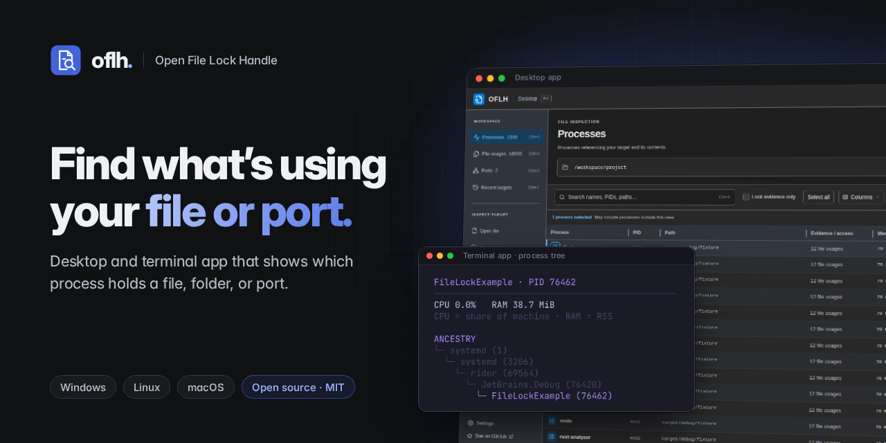
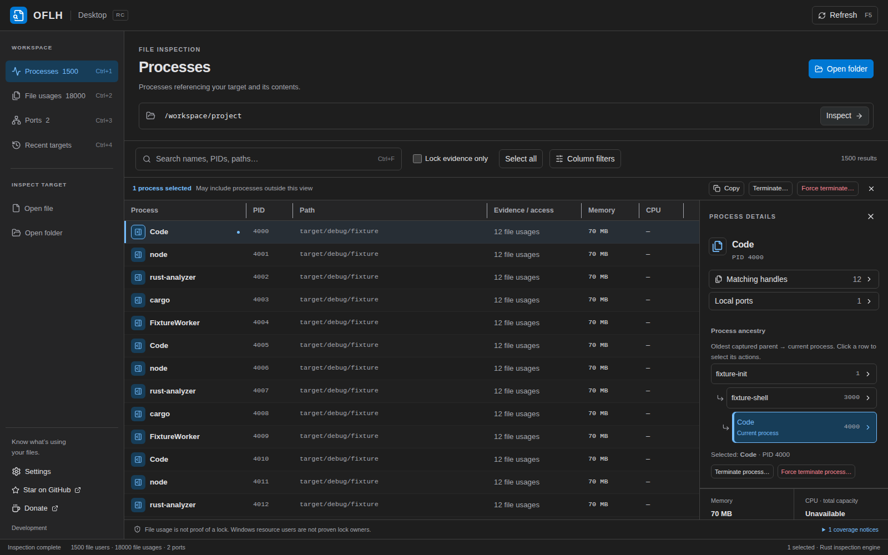
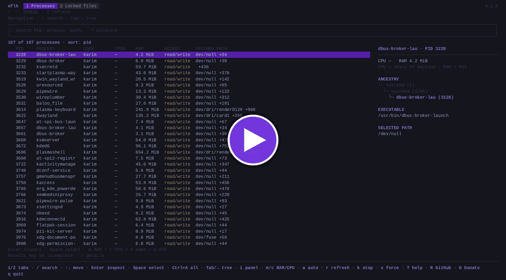

<p align="center">
  
</p>

<h1 align="center">Open File Lock Handle (oflh)</h1>

<p align="center"><b>Find which process is using a file, folder, or port on Windows, Linux, and macOS.</b></p>

<p align="center">
  
</p>

<p align="center"><a href="https://oflh.karimzouine.com/">oflh.karimzouine.com</a></p>

<p align="center">
  <a href="https://github.com/karimz1/open-file-lock-handle/actions/workflows/ci.yml"></a>
  <a href="https://github.com/karimz1/open-file-lock-handle/releases/latest"></a>
  <a href="https://github.com/karimz1/open-file-lock-handle/releases"></a>
  <a href="LICENSE"></a>
</p>

`oflh` shows which processes have a file or folder open and which process owns
a local port, then lets you close the right one. It comes as an interactive
terminal app and a desktop app, both built on the same Rust scanner.

Reach for it when:

- Windows says *"The action can't be completed because the file is open in another program"*
  or *"The process cannot access the file because it is being used by another process"*.
- `rm`, `umount`, or a build fails with *"Device or resource busy"* or *"Text file busy"*.
- A dev server won't start because of *"address already in use"* (`EADDRINUSE`).
- A folder can't be renamed or deleted and you don't know which file inside it is held.



[](https://asciinema.org/a/1266562)

[Terminal demo (GIF)](images/demo.gif) · [asciinema recording](https://asciinema.org/a/1266562)

## Contents

- [Why oflh](#why-oflh)
- [Install](#install)
- [Quick start](#getting-started)
- [Scan performance](#fast-whole-drive-file-usage-scans)
- [Limitations](#platform-behavior)
- [Privacy](#privacy)
- [FAQ](#faq)
- [Documentation](#project-references)

## Why oflh

**Whole-drive scans take a fraction of a second.** Inspecting all of `C:\`
took 352 ms on a GitHub Actions runner. oflh does not walk the directory tree. It asks the operating system which files each running process
holds and matches those references against your target. The cost grows with
the number of open handles on the system, not the number of files on disk, so
`C:\` or `/` is barely slower than a small folder. See
[measured scan times](#fast-whole-drive-file-usage-scans).

**One tool, three platforms, files and ports together.** The same workflow and
search syntax work on Windows, Linux, and macOS, on x86-64 and ARM64. Port
lookup reads OS socket tables directly; oflh does not shell out to `lsof`,
`ss`, `netstat`, or `handle.exe`.

<a id="follow-the-parent-process-tree"></a>
**It tells you which app to close, not just which PID.** Every result carries
the process's parent chain, so a `node` or `dotnet` worker can be traced back
to the editor, terminal, or service that started it.

**It separates "open" from "locked".** A file being open does not mean it is
locked. oflh reports lock evidence separately (POSIX/flock/OFD locks on Linux,
byte-range conflicts on macOS, sharing violations on Windows) and says plainly
when the owner of a Windows lock cannot be proven.

**It is careful with your processes.** oflh never closes handles inside another
process. To free a file it asks the application to close, or terminates the
process after a confirmation that defaults to **Cancel**. Before acting it checks
that the PID still belongs to the same process (PID plus start time), so a
reused PID cannot redirect the action.

**Small, local, open source.** The terminal app is a single 5–6 MB executable
with no installer or runtime. Scanning happens on your machine; nothing about
your files or processes is uploaded. MIT licensed, and every pull request is
tested on native Linux, macOS, and Windows runners for both x86-64 and ARM64.

<a id="platforms"></a>

## Install

Every [GitHub release](https://github.com/karimz1/open-file-lock-handle/releases/latest)
has builds for Windows, Linux, and macOS on x86-64 (`amd64`) and ARM64 (`arm64`,
including Apple Silicon), plus a `checksums.txt` with SHA-256 hashes. The
[website](https://oflh.karimzouine.com/) picks the right download for you.

<a id="cli-tui-install"></a>

### Terminal app

Homebrew (macOS and Linux):

```sh
brew install karimz1/tap/oflh-cli
```

Or download the standalone executable for your platform. It needs no installer:

| Platform | File |
| --- | --- |
| Windows | `oflh-cli.windows.amd64.exe`, `oflh-cli.windows.arm64.exe` |
| Linux | `oflh-cli.linux.amd64`, `oflh-cli.linux.arm64` |
| macOS | `oflh-cli.darwin.arm64` (Apple Silicon), `oflh-cli.darwin.amd64` (Intel) |

```sh
# macOS / Linux
chmod +x ./oflh-cli.darwin.arm64
./oflh-cli.darwin.arm64 ./build
```

```powershell
# Windows (PowerShell)
.\oflh-cli.windows.amd64.exe .\build
```

Rename the file to `oflh` (`oflh.exe` on Windows) and put it on your `PATH` to
run it from anywhere.

<a id="desktop-install"></a>

### Desktop app

| Platform | Package |
| --- | --- |
| Windows | `oflh-desktop.windows.<arch>-installer.exe` |
| macOS | `oflh-desktop.darwin.<arch>.dmg` |
| Linux | `.deb`, `.rpm`, or a `.tar.gz` archive for other glibc distributions ([details](docs/desktop-usage.md#linux-archive-installation)) |

On Windows and macOS the app can download and install updates itself after
you confirm; on Linux, install new packages manually. ARM32 is not supported.

<a id="unsigned-installers"></a>

### Unsigned installers

Releases are not code-signed or notarized, so Windows may show "unknown
publisher" and macOS Gatekeeper may block the app. Verify the download against
`checksums.txt` before bypassing the warning. If macOS reports the app as
damaged, clear the quarantine flag:

```sh
xattr -cr "/Applications/OFLH Desktop.app"
```

<a id="build-from-source"></a>

### Build from source

With [rustup](https://rustup.rs) installed (the pinned toolchain is fetched automatically):

```sh
git clone https://github.com/karimz1/open-file-lock-handle.git
cd open-file-lock-handle
cargo build --release --locked --bin oflh
./target/release/oflh .
```

The desktop app also needs Node.js and the Tauri system libraries; see
[Development](docs/development.md).

<a id="getting-started"></a>

## Quick start

### Terminal

```sh
oflh                       # current directory, including subfolders
oflh ./build               # a folder
oflh ./build/plugin.dll    # a single file
oflh --port 3000           # TCP listener or bound UDP socket on port 3000
oflh --ports               # all local listening/bound ports
```

Inspect a whole drive or filesystem the same way:

```powershell
oflh 'C:\'      # PowerShell
```

```sh
oflh /
```

oflh opens an interactive view. A folder scan of a build directory looks like
this (abridged from the terminal snapshot tests):

```text
  oflh   1 Processes  2 Locked files  3 Ports
  /build  ·  MANUAL · r refresh
  1 of 1 processes · sort: pid
     PID     PROCESS   USER    CPU%   RAM        ACCESS      PORTS  MATCHED PATH
     424242  dotnet    alice   2.4%   31.0 MiB   read/write  0      FileLockExampleCli.dll +2
```

Press `Enter` to see every file the process uses, `Tab` to walk up its parent
tree, and `k` to ask it to close.

| Key | Action |
| --- | --- |
| `1` `2` `3` | Processes, Locked files, Ports |
| `↑` `↓` `Enter` | Move and open process details |
| `/` | Search; supports `*` wildcards and word initials |
| `Tab` | Focus the parent process tree |
| `k` / `x` | Close / force-kill, after confirmation |
| `r` | Refresh |
| `?` | All shortcuts and scan warnings |
| `q` | Quit |

The [terminal guide](docs/terminal-usage.md) covers search syntax, port scoping,
and process actions.

### Desktop

1. Choose **Open file** or **Open folder**, or drop a path onto the window.
2. Click a process to see its matching files, local ports, and parent tree.
3. Narrow the list with search, **Column filters**, or **Lock evidence only**.
4. Close the application normally, or use **Terminate** from oflh. Save your work
   first; terminating a process can lose unsaved changes.
5. Refresh (`F5`) to confirm the file is no longer in use.

The [desktop guide](docs/desktop-usage.md) covers filters, selection, ports,
and administrator retry.

<a id="fast-whole-drive-file-usage-scans"></a>

## Scan performance

Recorded scans with an entire drive or root as the target:

| Platform | Target | Scan time |
| --- | --- | ---: |
| Windows x64 | `C:\` | [352 ms](docs/measurements/inspection-windows-x64-2026-10-06.json) |
| Windows ARM64 | `C:\` | [510 ms](docs/measurements/inspection-windows-arm64-2026-10-06.json) |
| Linux x86-64 | `/` | [195 ms](docs/measurements/inspection-linux-2026-10-05.json) |

These are single backend measurements from October 2026: Windows on GitHub's
native runners, Linux on a local machine. They exclude app startup and
rendering, and each scan reported some permission warnings. Your numbers will
depend on hardware, process count, and privileges.

On a synthetic Windows folder of 2,048 files with 128 held open, the current
backend takes 315 ms on x64 and 353 ms on ARM64, down from 3,303 ms and
5,384 ms with the earlier Restart Manager backend (median of five runs).
[Inspection performance](docs/inspection-performance.md) has the method, raw
data, and commands to reproduce.

<a id="platform-behavior"></a>

## Limitations

- **Open is not locked.** The Processes view lists every process with a
  reference to the target. Only **Locked files** requires lock evidence.
- **Windows cannot always name the lock owner.** A sharing violation proves the
  file is restricted, not which process restricted it. Such rows are labeled
  *owner unverified*.
- **You see what your account can see.** Processes owned by other users or
  protected by the OS may be missing; scans with gaps show *"Results may be
  incomplete"*. Run elevated for broader coverage.
- **Results are a snapshot.** An empty result does not guarantee the file is
  free a moment later. Refresh after closing a program.
- **Ports are local bindings only:** TCP listeners and bound UDP sockets, not
  established connections or remote reachability.
- **Terminating has consequences.** Unsaved work can be lost, and stopping a
  parent can take its children with it.

[Platform support](docs/platform-support.md) details what each OS backend can
and cannot detect.

## Privacy

Scanning is local. File names, file contents, process data, and results never
leave your machine. Release builds check for a newer version at startup and
hourly by fetching a small JSON manifest from the OFLH website (GitHub as a
fallback); the request carries no paths or process data. Turn it off in the
terminal app with `--no-update-check`.

## FAQ

### How do I find which process is locking a file on Windows?

Run `oflh path\to\file` in a terminal, or open the file in OFLH Desktop. You get
every process Windows reports as using that file, including programs that
loaded it as a module, and the **Locked files** view shows whether the file
currently has a read, write, or delete sharing conflict. To
check a folder or a whole drive, pass the folder or `C:\` instead.

### How do I find which process is using a port?

`oflh --port 8080` lists the TCP listener or bound UDP socket on that port with
its PID, process name, and address. `oflh --ports` lists all of them. In the
desktop app, open the **Ports** view and search `port:8080`.

### Why can't I delete a folder even though no file in it is open in an editor?

Something else has a file, a memory mapping, or the folder itself open: a
terminal whose working directory is inside it, a build server, an indexer, or
antivirus. Point oflh at the folder; it checks every descendant in one scan and
shows how each process uses it: open file, mapped file, executable, or
(on Linux and macOS) working directory.

### Can oflh unlock a file without closing the program?

No. Tools that force-close a handle inside another process can corrupt that
program's state, so oflh does not do it. It identifies the process and lets you
close it normally or terminate it.

### Do I need administrator or root rights?

No. oflh runs as a normal user and shows the processes your account can
inspect. Running it elevated reveals more processes. The desktop app offers
**Retry with administrator privileges** when a termination is denied.

### How is it different from `lsof`, `fuser`, or Resource Monitor?

Those are good tools tied to one platform. oflh gives the same interactive view
on Windows, Linux, and macOS, covers files and ports in one place, shows each
process's parent chain, reports lock evidence separately from plain open files,
and can scan a whole drive quickly because it never walks the directory tree.

### Can I use oflh in scripts?

Not yet. Both interfaces are interactive: the terminal app exits with an error
when stdin or stdout is not a terminal, and there is no JSON output mode.

### Is it safe to run?

oflh reads process and socket information from the OS. It never writes to the
files it inspects.
Process actions always ask for confirmation with **Cancel** preselected and
re-verify the process identity before sending anything.

<a id="project-references"></a>

## Documentation

| Guide | What's in it |
| --- | --- |
| [Terminal guide](docs/terminal-usage.md) | Search syntax, ports, process actions, keys, languages |
| [Desktop guide](docs/desktop-usage.md) | Inspecting, filtering, ports, actions, updates |
| [Platform support](docs/platform-support.md) | How each OS backend works and what it can miss |
| [Inspection performance](docs/inspection-performance.md) | Benchmarks and how to reproduce them |
| [Development](docs/development.md) | Building, testing, and project layout |
| [Architecture](docs/architecture.md) | Crates, threading, process-safety design |
| [Contributing](CONTRIBUTING.md) | Bug reports and pull requests |

The terminal app and CLI help are available in English, German, and Simplified
Chinese (`--language en|de|zh`); so is the desktop app (Settings → Language).

Found a bug? [Open an issue](https://github.com/karimz1/open-file-lock-handle/issues).
oflh is an independent project released under the [MIT License](LICENSE). If it
saves you time, you can support it through
[GitHub Sponsors](https://github.com/sponsors/karimz1) or
[Buy Me a Coffee](https://buymeacoffee.com/karimz1).
