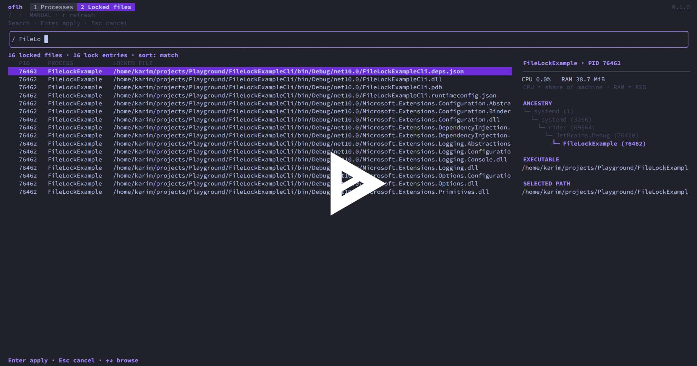

<p align="center">
  
</p>

# Open File Lock Handle (oflh)

[](https://oflh.karimzouine.com/)
[](https://oflh.karimzouine.com/de#download)
[](https://github.com/karimz1/open-file-lock-handle/tree/main/crates/oflh-desktop/ui/src/locales)
[](https://github.com/karimz1/open-file-lock-handle/releases)
[](https://github.com/karimz1/open-file-lock-handle/actions/workflows/ci.yml)
[](LICENSE)

oflh shows which processes are using a file, folder, or local port. Use it to
investigate files that cannot be deleted or replaced, folders still in use, and
“port already in use” errors.

Choose the desktop app or the interactive terminal app. Both run on Linux,
macOS, and Windows. Inspect file usages and lock evidence, find local port owners,
and follow a process's parent tree to identify the application behind it.

Optimized for fast file usage inspection, including a whole Windows `C:\` drive
or Linux `/`. oflh follows live process references instead of walking every unused
file on disk, making it useful when a large folder is in use and you do not know
which file or process to look for. Desktop and terminal share the same scanner.

[Install](#install) · [Quick start](#getting-started) · [Scan performance](#fast-whole-drive-file-usage-scans) · [Build from source](#build-from-source)

## Fast whole-drive file usage scans

Recorded backend inspections with the entire drive or root as the target:

| Platform | Target | Measured scan time |
| --- | --- | ---: |
| [Windows x64](docs/measurements/inspection-windows-x64-2026-10-06.json) | `C:\` | **352 ms** |
| [Windows ARM64](docs/measurements/inspection-windows-arm64-2026-10-06.json) | `C:\` | **510 ms** |
| [Linux x86-64](docs/measurements/inspection-linux-2026-10-05.json) | `/` | **195 ms** |

Single backend measurements from 5–6 October 2026: Windows on native GitHub
runners, Linux locally. They measure accessible process references, not app
startup or every disk file. Each scan reported coverage warnings; timings vary
with hardware, workload, and permissions.

An equivalent Windows fixture with 2,048 files and 128 held files also improved
from **3,303 to 315 ms on x64** and **5,384 to 353 ms on ARM64** (five-sample medians
against the earlier Restart Manager backend). See
[inspection performance](docs/inspection-performance.md) for methodology,
coverage checks, tradeoffs, and reproducible commands.

## Follow the parent process tree

A background helper's name may not tell you which app it belongs to. Select a
file or port user to see its parent process tree, then inspect the recorded
parents. For example, a `node.exe` worker may lead back to an editor or terminal
session. This helps you find the app to close when a file stays in use or a
development server keeps a port occupied.

Both editions show process ancestry. See the
[Desktop guide](docs/desktop-usage.md#follow-the-parent-process-tree) for the
details panel or the [Terminal guide](docs/terminal-usage.md#process-actions)
for keyboard navigation.

## Desktop


## Terminal

[](images/demo.gif)

[Watch the terminal recording](https://asciinema.org/a/1266562)

## Install

Download the build for your operating system and CPU from
[GitHub Releases](https://github.com/karimz1/open-file-lock-handle/releases).
`amd64` means x86-64; `arm64` includes Apple Silicon. For an easier way to find
the right download and view screenshots, visit the [website](https://oflh.karimzouine.com/).

<a id="desktop-install"></a>

### Desktop

| Platform | Download |
| --- | --- |
| macOS | `.dmg` |
| Linux | `.deb`, `.rpm`, or a manual `.tar.gz` archive (x86-64 / ARM64) |
| Windows | `-installer.exe` |

Open the installer and follow its steps. Desktop installers are unsigned; see
[installation warnings](#unsigned-installers) if your OS blocks them.

For Arch and other compatible glibc distributions, use the Linux archive after
installing its system libraries. See
[Linux archive installation](docs/desktop-usage.md#linux-archive-installation)
for extraction and dependencies. ARM32 builds are not available.

<a id="cli-tui-install"></a>

### Terminal

With Homebrew on macOS or Linux:

```sh
brew install karimz1/tap/oflh-cli
```

Alternatively, download a standalone CLI executable. On macOS or Linux, make it
executable and run it directly. For example, on macOS ARM64:

```sh
chmod +x ./oflh-cli.darwin.arm64
./oflh-cli.darwin.arm64 ./build
```

Use the filename of your download. On Windows x86-64, run from PowerShell:

```powershell
.\oflh-cli.windows.amd64.exe .\build
```

You can rename the executable to `oflh` (`oflh.exe` on Windows) and place it on
`PATH` to use the commands below from any directory.

<a id="getting-started"></a>

## Quick start

### Desktop

1. Open the app and choose **Open file** or **Open folder**, or drop a path into the window.
2. Select a process to inspect its file usages, local ports, and ancestry.
3. Search or filter the results. Use **Lock evidence only** to focus on reported locks.
4. To free a file, close the application normally or terminate its process from
   oflh after confirmation. Save your work first; termination can lose unsaved changes.
5. Refresh to check the current file usage.

See the [Desktop user guide](docs/desktop-usage.md) for filters, selection, and actions.

### Terminal

Run in an interactive terminal. With no path, oflh scans the current directory;
folder scans include descendants.

```sh
oflh ./build                 # Processes using this folder
oflh ./build/plugin.dll      # Processes using one file
oflh --port 3000             # Local TCP listener or UDP binding on port 3000
```

For broad file usage inspection, target the entire Windows drive in PowerShell:

```powershell
oflh 'C:\'
```

Or target the Linux filesystem root:

```sh
oflh /
```

In the desktop app, choose the same root with **Open folder**. These scans show
accessible file users below the selected root; check scan warnings for permission
limits. On Windows, reported file users do not prove which process caused a lock.

| Key | Action |
| --- | --- |
| `1` / `2` / `3` | Processes / Locked files / Ports |
| `↑` / `↓`, `Enter` | Select and inspect a process |
| `/` | Search |
| `r` | Refresh |
| `?` | Help and scan warnings |
| `q` | Quit (outside search editing) |

See the [Terminal user guide](docs/terminal-usage.md) for search, selection, and actions.

<a id="platform-behavior"></a>

## Limitations

An open file is not always locked. The lock filter shows reported lock evidence;
on Windows, file users and sharing conflicts cannot reliably identify the process
causing a lock. Permissions can limit results. Refresh after closing a program;
an empty result alone does not guarantee a file is free. Ports show local TCP
listeners and bound UDP sockets.

Close the owning application normally when possible. Termination can lose unsaved
work, and stopping a parent can affect its children. Actions require confirmation.
See [platform support](docs/platform-support.md) for detection limits.

## Privacy

File and process inspection runs locally. File contents and scan results are not
uploaded. Update checks contact the OFLH website, with GitHub as a fallback;
desktop update downloads use GitHub Releases. Terminal users can disable checks
with `--no-update-check`. See [release notices](docs/terminal-usage.md#release-notices).

## Build from source

See [Development](docs/development.md) for prerequisites and the commands to build
and run either the CLI or Desktop locally.

## Unsigned installers

Downloads are unsigned. Your system may show a publisher or signature
warning, such as “unknown publisher” on Windows. Only bypass a warning for a
download you trust. Releases include `checksums.txt` for checking SHA-256 hashes.

- **macOS:** If Gatekeeper blocks the installed app or reports it as damaged,
  clear its quarantine flag with `xattr -cr "/Applications/OFLH Desktop.app"`,
  then reopen it. Adjust the path if installed elsewhere.

<a id="platforms"></a>

Release targets are Linux, macOS, and Windows on x86-64 and ARM64. Available
packages are listed on the release page.

<a id="project-references"></a>

## Documentation

[Browse the documentation](docs/README.md) for task-based guides and contributor references.

- [Terminal guide](docs/terminal-usage.md) and [Desktop guide](docs/desktop-usage.md)
- [Platform support and limitations](docs/platform-support.md)
- [Scan performance and recorded benchmarks](docs/inspection-performance.md)
- [Building and testing](docs/development.md)
- [Contributing](CONTRIBUTING.md), [Architecture](docs/architecture.md),
  and [Releasing](docs/releasing.md)

Report bugs in [GitHub Issues](https://github.com/karimz1/open-file-lock-handle/issues).
Licensed under [MIT](LICENSE).
