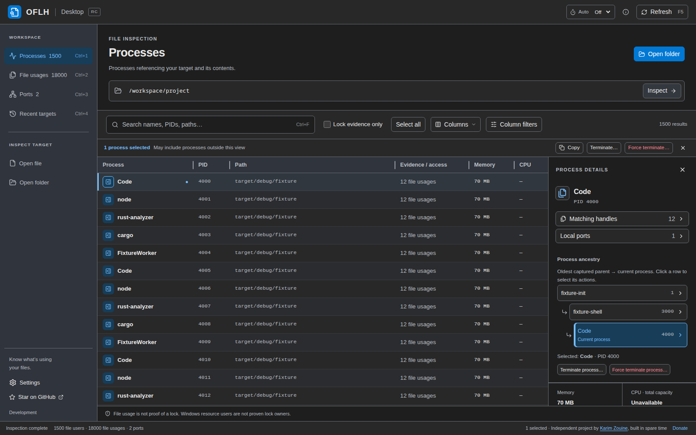
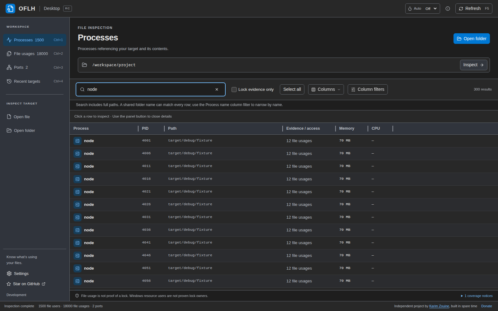

# Using OFLH Desktop

Find which processes are using a file, folder or local port without opening a
terminal. For installation and the first scan, see the [README quick start](../README.md#getting-started).
The [terminal guide](usage.md) covers the separate CLI/TUI interface.

## Inspect files and processes

Drop a file or folder anywhere in the window, choose **Open file** / **Open folder**,
or type a path and choose **Inspect**. **Recent targets** lets you revisit targets
from previous launches. Folder scans include descendants.

**Processes** groups results by process. **File usages** shows individual matching
observations. Click a row to open details. Use the panel button or close button to
close it. Table paths are shortened for readability. Full paths and copy/reveal
actions are available in details. Drag column dividers or the details panel edge
to resize.

The details panel puts **Matching handles**, **Local ports**, and **Process ancestry**
near the top. Ancestry reads from oldest captured parent down to the highlighted
current process. Click an ancestor to select its process actions.

An open file is not proof of a lock. **Lock evidence only** restricts results to
reported evidence. Windows resource users are not proven lock owners. Open
**coverage notices** below the table for permissions and scan limitations.

## Search and filters

Search checks process names, PIDs and full paths using the Rust matcher. A shared
folder name can match every row. To search only names, open **Column filters**
and fill **Process name**. Filters combine with the main search and process scope.

Column filters include exact PID, path, CPU and memory bounds, evidence, and
access/relation. Numeric bounds are inclusive. Unknown metrics do not match a
numeric bound. An unavailable CPU sample is not zero. Choose **Apply filters**
to apply, or **Clear filters** to reset column predicates.

In **Ports**, search `port:3000` for an exact port or `30` for matching fragments.
You can combine terms such as `port:3000 tcp`, `udp`, `ipv6` or `pid:1234`.
The view lists local TCP listeners and bound UDP sockets, not network reachability.
**Target processes only** limits owners to processes seen using the inspected path.
Opening **Local ports** from details scopes results to that captured process.
Refresh and termination preserve that scope: an empty result can confirm that the
process's bindings disappeared. Clear the scope explicitly to see other owners.

## Selection and copying

Click a row for details. Ctrl/Cmd-click adds or removes a process. Shift-click
selects a range. Selection represents processes, so several file rows belonging
to one process can highlight together. Select All applies to the filtered results.
Selections can include processes outside the current view. The action bar and
confirmation disclose that.

Use the context menu or details actions to copy paths, filenames, process names,
or PIDs. Ctrl/Cmd+C copies selected rows while the table is focused. Reveal opens
the OS file manager for the selected native path.

## Process actions

Close the owning application normally when possible. **Terminate** requests the
normal platform action. **Force terminate** is a separate, stronger action.
Review the named processes and PIDs before confirming. Cancel is the default.
Stopping a parent process can affect its children or your session.

Rust revalidates captured process identities before acting, checks whether the
original process exited, and refreshes results. A request is not proof of exit:
permission failures, still-running processes and unavailable verification are
reported separately. OFLH never silently escalates to force termination.

## Keyboard and refresh

The full shortcut list is shown in Settings and beside relevant controls. Press
`F5` or `Ctrl/Cmd+R` to refresh. Choose an automatic refresh interval beside the
Refresh button. Automatic scans pause during active scans and process-action
confirmations. Scan progress and Cancel stay in the footer without moving the
results table.

## Appearance

**Settings** at the bottom left offers Light, System, Rider Dark, VS Code Dark
and OFLH Purple, plus font size. Your theme, font size and details width persist.
The first launch offers a theme choice. The app remembers these settings between
launches.

## Updates

Settings also has an **Updates** section. OFLH Desktop checks for a newer
release on launch. On Windows and macOS installs, "Install and restart" downloads
and installs the update, then relaunches the app. Other packages (for example
Linux `.deb`/`.rpm` installs) show "View release notes" instead; use your
package manager or the [releases page](https://github.com/karimz1/open-file-lock-handle/releases)
to update.

For OS limitations, see [platform support](platform-support.md). For build,
testing and packaging details, see [development](development.md) and the
[RC validation checklist](desktop-rc.md).
