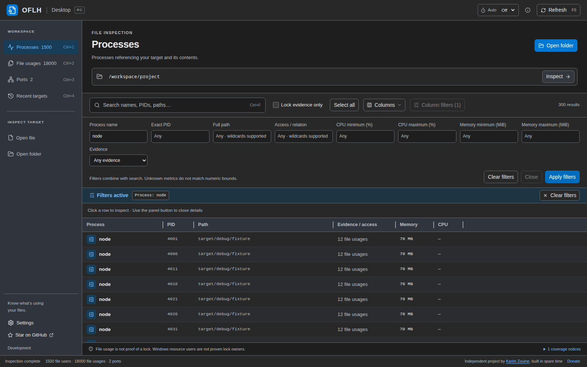
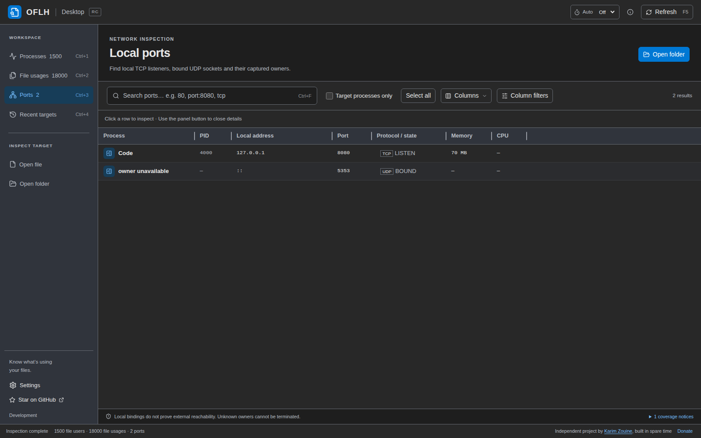

# Desktop guide

OFLH Desktop shows which processes use a file, folder, or local port, in a
window. It uses the same scanner as the [terminal app](terminal-usage.md). For
downloads, see the [README](../README.md#desktop-install).

- [Inspect a file or folder](#inspect-files-and-processes)
- [Follow the parent process tree](#follow-the-parent-process-tree)
- [Search and filters](#search-and-filters)
- [Ports](#ports)
- [Selection and copying](#selection-and-copying)
- [Process actions](#process-actions)
- [Refresh and long scans](#keyboard-and-refresh)
- [Keyboard shortcuts](#keyboard-shortcuts)
- [Appearance and language](#appearance)
- [Updates](#updates)
- [Linux archive installation](#linux-archive-installation)

## Inspect files and processes

When no target is open, the workspace prompts you to drag a file or folder
onto it. If an inspection finds no matching processes, the empty result keeps
the permission notice and explains how to inspect another target.

Open a target in any of these ways:

- Drop a file or folder onto the window while outside the **Ports** view.
- Choose **Open file** (`Ctrl+O`) or **Open folder** (`Ctrl+Shift+O`), either
  at the top of the page or with the file and folder buttons at the left of the
  target box.
- Type or paste a path into the target box and press `Enter` or choose
  **Inspect**. Surrounding quotes, such as those added by Windows
  **Copy as path**, are removed.
- Pick one of your last twelve targets under **Recent targets** (`Ctrl+4`).
- On Windows, right-click a file and choose **Inspect file**, or right-click a
  folder, a drive, or the empty area of a folder window and choose
  **Inspect folder**. See [Explorer context menu](#explorer-context-menu).

Choose **New window** (`Ctrl+Shift+N`) to open a separate OFLH instance with its
own inspection. Dropping a target while another inspection is open asks where
to open it: **This window** replaces the current inspection, **New window**
keeps it open, and **Cancel** leaves it unchanged. Cancel is focused by default.
The first drop into an empty window starts inspecting immediately. The **Ports**
view ignores file and folder drops.

A folder target includes everything below it, so you can open `C:\` or `/` to
search the whole system. The sidebar switches between two views of the result:

- **Processes** (`Ctrl+1`) has one row per process.
- **File usages** (`Ctrl+2`) has one row per matching file reference.

Click a row to open its details panel: **Matching handles**, **Local ports**,
and **Process ancestry**, with full paths and buttons to copy a path or reveal
it in the file manager. Table paths are shortened to fit; the details show them
in full.

An open file is not proof of a lock. Tick **Lock evidence only** to keep only
rows with lock or sharing-conflict evidence. On Windows, reported users of a
locked file are not proven to be the process holding the lock. When a scan
could not see everything, open **coverage notices** below the table to see why.

On Windows, ordinary drive and network paths are shown as `C:\…` or
`\\server\share\…`. Paths that need the extended namespace keep their `\\?\`
prefix, including in copied text, so they mean the same thing wherever you
paste them.

Choose **Close inspection** beside the target field to remove the target,
results, and row selection. Recent targets are kept. This action does not
terminate processes or change files. **Deselect all** in the selection bar
removes only the row selection.

### Explorer context menu

The Windows installer adds **Inspect file** and **Inspect folder** to the
File Explorer context menu. The option is on the installer's welcome page and
is checked by default. Entries appear for one selected item at a time.

Choosing an entry starts OFLH Desktop and inspects the item. Repeated Explorer
or Start menu launches use the same window and bring it to the front. An Explorer
target replaces that window's inspection, cancelling any scan still running
there. An open window
running as administrator cannot receive targets from Explorer, so a second
window opens in that case.

**New window** and the drop dialog's **New window** choice open independently
on Windows too, keeping the existing inspection and selection. These independent
windows do not receive Explorer launches.

- On Windows 11, the entries are under **Show more options** (or
  `Shift+F10`), not in the shortened first menu.
- The labels use the Windows display language at install time: English,
  German, or Simplified Chinese, with English for other languages. Updates
  rewrite them, so they follow a changed display language after the next
  update.
- The entries are registered for the account that installed OFLH Desktop and
  are removed by the uninstaller. Updates and passive or silent installs keep
  your previous choice. Pass `/NOCONTEXTMENU` to the installer to leave them
  out.
- To start an inspection from a script or shortcut, run
  `oflh-desktop.exe --inspect "<path>"`. A relative path is resolved against
  the directory you run it from.

## Follow the parent process tree

A helper such as `node`, `dotnet`, or `python` rarely tells you which app to
close. Select it and look at **Process ancestry** in the details panel. The tree
runs from the oldest recorded parent (up to eight levels) down to the selected
process. Click any parent to inspect it or use its process actions.

Parents oflh could not identify are shown as unavailable and cannot be acted
on. Stopping a parent can close its whole application and affect its children.

## Search and filters



The search box (`Ctrl+F` or `/`) matches process names, PIDs, and full paths
with the same rules as the [terminal search](terminal-usage.md#search),
including `*` wildcards and initials. Because full paths are searched, a folder
name can match every row; to match names only, use **Column filters**.

**Column filters** add per-column conditions: process name, exact PID, full path,
access or relation, CPU and memory ranges, and evidence type. They combine with
the main search. Numeric bounds are inclusive, and a process whose CPU or memory
could not be measured never matches a numeric bound. Choose **Apply filters**
to apply them or **Clear filters** to remove them.

Search, filters, column widths, and the details panel all survive a refresh.

## Ports



**Ports** (`Ctrl+3`) lists local TCP listeners and bound UDP sockets with their
owning process. It does not show established connections or tell you whether a
port is reachable from another machine.

File and folder picker controls are hidden in **Ports**. File and folder drops
are ignored there; switch to **Processes** or **File usages** to inspect a path.

Search `port:3000` for an exact port, `30` for any port containing 30, or
combine terms: `port:3000 tcp`, `udp`, `ipv6`, `pid:1234`. **Target processes
only** keeps owners that also use the inspected path.

Opening **Local ports** from a process's details scopes the view to that one
process. The scope survives refresh and termination, so an empty list confirms
the process's ports are gone. Clear the scope to see everything again.

## Selection and copying

Click selects a row, `Ctrl`/`Cmd`-click toggles a process, `Shift`-click selects
a range, and **Select all** (`Ctrl+A`) selects every row that matches the
current filters. Selection is per process: several file rows of the same
process highlight together. Selections can include processes that the current
filter hides; the action bar and confirmation say so.

`Ctrl+C` copies the selected rows. The context menu and details panel copy a
path, file name, process name, or PID, and **Reveal** opens the file manager at
the native path.

## Process actions

The safest way to free a file or port is to close the application normally.
When that is not possible:

- **Terminate** asks the process to exit (`SIGTERM` on Linux and macOS, a
  window-close request on Windows).
- **Force terminate** kills it immediately, without cleanup.

Both open a confirmation listing every target by name and PID, with **Cancel**
as the default. Save your work first. Before acting, oflh checks that each PID
still belongs to the process you selected; results refresh afterwards.

If a normal termination fails or the process is still running, the results
dialog offers **Force terminate** for just those processes, again behind a
confirmation. Normal termination never escalates automatically, and processes
whose identity changed or could not be checked are not offered this option.

### Administrator retry

When termination fails only because of permissions, the results dialog offers
**Retry with administrator privileges…** for the denied processes, keeping the
same normal or force mode. It opens a fresh confirmation; nothing is elevated
without your approval.

The app itself stays unprivileged. On confirmation it starts a short-lived,
headless copy of itself with administrator rights, which re-checks each
process's identity and protection before acting:

| OS | Elevation prompt |
| --- | --- |
| Windows | UAC |
| Linux | `/usr/bin/pkexec` (needs polkit and an authentication agent) |
| macOS | System administrator prompt via `osascript` |

The OS may prompt once per process; cancelling a prompt stops the remaining
requests. Administrator rights do not override protected processes, and the
unprivileged app may be unable to confirm afterwards that the process exited.

<a id="long-running-inspections"></a>
<a id="keyboard-and-refresh"></a>

## Refresh and long scans

Refresh with `F5` or `Ctrl+R`. The **Auto** control next to **Refresh** repeats
the scan at an interval you choose; it is off at every launch and pauses during
scans and confirmations.

Opening a target or refreshing manually keeps the workspace visible and locks
inspection controls and tab switching immediately. The footer reports the work
and elapsed time. For scans lasting more than a quarter second, **Cancel** and
**Show inspection progress** appear; the latter opens stage and work counters. There is no percentage,
because the total amount of work is not known in advance. **Cancel** keeps the
previous results; an OS call already in progress may take a moment to return.

Automatic refreshes run in the background instead: the current results stay
usable, the footer shows **Updating results…** with a **Cancel** button, and new
rows replace old ones in place without losing your scroll position. The footer
also shows how long the last completed scan took.

If a process exits or stops matching, its open details panel says so and its
actions are disabled. A failed refresh keeps the old results and shows the
error.

## Keyboard shortcuts

`Ctrl` is `Cmd` on macOS. The full list is in **Settings**.

| Shortcut | Action |
| --- | --- |
| `Ctrl+O` / `Ctrl+Shift+O` | Open file / open folder |
| `Ctrl+Shift+N` | Open a new OFLH window |
| `Ctrl+1` … `Ctrl+4` | Processes / File usages / Ports / Recent targets |
| `Ctrl+Tab` / `Ctrl+Shift+Tab` | Next / previous view |
| `Ctrl+F` or `/` | Focus search |
| `F5` or `Ctrl+R` | Refresh |
| `Ctrl+A` / `Ctrl+C` | Select all / copy selected rows |
| `Ctrl+Shift+D` | Toggle the details panel |
| `Ctrl+B` | Collapse or expand the sidebar |
| `Ctrl++` / `Ctrl+-` / `Ctrl+0` | Larger / smaller / default font size |
| `Ctrl+,` | Settings |
| `Esc` | Leave search, or clear the selection |

Double-click a column divider to fit the column to its contents, including rows
that are scrolled out of view. A focused divider can be resized with the arrow
keys. **Fit all columns** fits every visible column.

## Appearance

The gear menu at the bottom left opens **Settings** and **Themes**. Themes are
Light, System, Rider Dark, VS Code Dark, and OFLH Purple; **System** switches
between Light and VS Code Dark with your OS. Settings also controls font size
and language (English, German, Simplified Chinese, or the system language). The
app remembers theme, font size, language, and details panel width.

## Updates

The app checks for a new release at startup and hourly. An available update
shows a **1** badge on the gear; nothing pops up on its own. Choose **Check for
updates** in the gear menu to check immediately.

On Windows and macOS, **Install and restart** downloads the signed update,
installs it, and relaunches the app. On Linux, the dialog links to the
[download page](https://oflh.karimzouine.com/#download); install the new
package or extract the new archive yourself.

**About OFLH** in the gear menu shows the installed version, commit, OS, and
license, with a button to copy them for bug reports.

**Donate**, at the bottom right, opens Buy Me a Coffee, GitHub Sponsors, or
PayPal in your browser.

## Linux archive installation

Use the archive when a `.deb` or `.rpm` doesn't suit your distribution. Download
`oflh-desktop.linux.amd64.tar.gz` (x86-64) or `oflh-desktop.linux.arm64.tar.gz`
(AArch64) from
[GitHub Releases](https://github.com/karimz1/open-file-lock-handle/releases),
verify it against `checksums.txt`, and run it from your graphical session:

```sh
sha256sum --ignore-missing -c checksums.txt
tar -xzf oflh-desktop.linux.amd64.tar.gz
./oflh-desktop/oflh-desktop
```

No root, package manager, or `PATH` change is needed. To update, download the
new archive and extract it into a fresh directory.

The archive contains the executable but not its system libraries. It needs a
glibc at least as new as Ubuntu 24.04's, GTK 3, WebKitGTK 4.1, and libsoup 3.
musl-based distributions such as Alpine are not supported. On Arch Linux:

```sh
sudo pacman -Syu webkit2gtk-4.1 gtk3
```

CI extracts and launches the archive as an unprivileged user on Ubuntu and
Fedora (x86-64 and ARM64) and on Arch Linux (x86-64).
